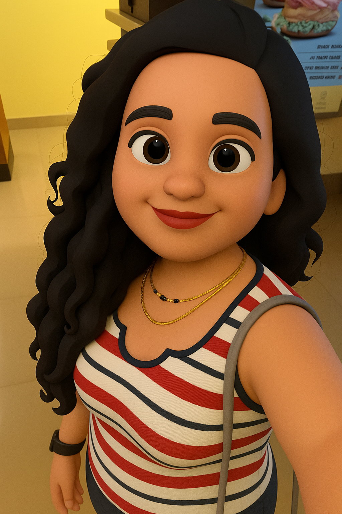

# Hi, I'm Ankita Thorve 👋

Frontend developer in progress — currently building daily mini projects in HTML, CSS, and JavaScript to sharpen fundamentals and UI instincts.

---

### What I'm focusing on

- Recreating real-world layouts and components
- Writing clean, semantic HTML and modern, responsive CSS
- Adding interactivity with vanilla JavaScript (DOM, events, state)

---

<!--### Projects from my learning journey

- [Project 1 – Short title](https://your-live-link.com) · [Code](https://github.com/your-username/project-1)
- [Project 2 – Short title](https://your-live-link.com) · [Code](https://github.com/your-username/project-2)
- [Project 3 – Short title](https://your-live-link.com) · [Code](https://github.com/your-username/project-3)

_(Pin your favourite repos so they show below this section.)_-->

---

### Tech I work with

HTML · CSS · JavaScript  
Git · GitHub · VS Code  

---

### Connect

- LinkedIn: [your-link](www.linkedin.com/in/ankita-thorve)
- Email: ankietathorve@gmail.com

<!--

  

-->

<!--
<h1 align="center">🌸 Hi, I’m Ankita! 🌸</h1>

Frontend Developer 💻 | Learning ReactJS 🌱 | Lover of minimal & aesthetic designs 🎨

  

---

### 🌼 About Me
- 👩‍💻 Self-taught Frontend Developer passionate about **clean, responsive UIs**  
- 🌱 Currently exploring **ReactJS** and **TailwindCSS**  
- 🎯 2025 Goal: Land a **Frontend Developer role (10 LPA)**  
- ☕ Fueled by coffee & my love for coding beautiful things ✨  

---

### 💻 Tech Stack

   
   
   
   
   

---

### 📦 Current Projects
🌿 **Portfolio Website** – Clean & minimal design with vanilla JS  
📝 **ToDo App** – Vanilla JS based task manager  
✨ **Frontend Mentor Challenges** – UI challenge solutions  

---

### 🌸 Let’s Connect!

  
  
  <!--

---

### 🌟 Fun Fact
I believe great UIs are like poetry—they flow beautifully and evoke a sense of emotion. ✨
-->

<!--
**ankitaThorve/ankitaThorve** is a ✨ _special_ ✨ repository because its `README.md` (this file) appears on your GitHub profile.

Here are some ideas to get you started:

- 🔭 I’m currently working on ...
- 🌱 I’m currently learning ...
- 👯 I’m looking to collaborate on ...
- 🤔 I’m looking for help with ...
- 💬 Ask me about ...
- 📫 How to reach me: ...
- 😄 Pronouns: ...
- ⚡ Fun fact: ...
-->
